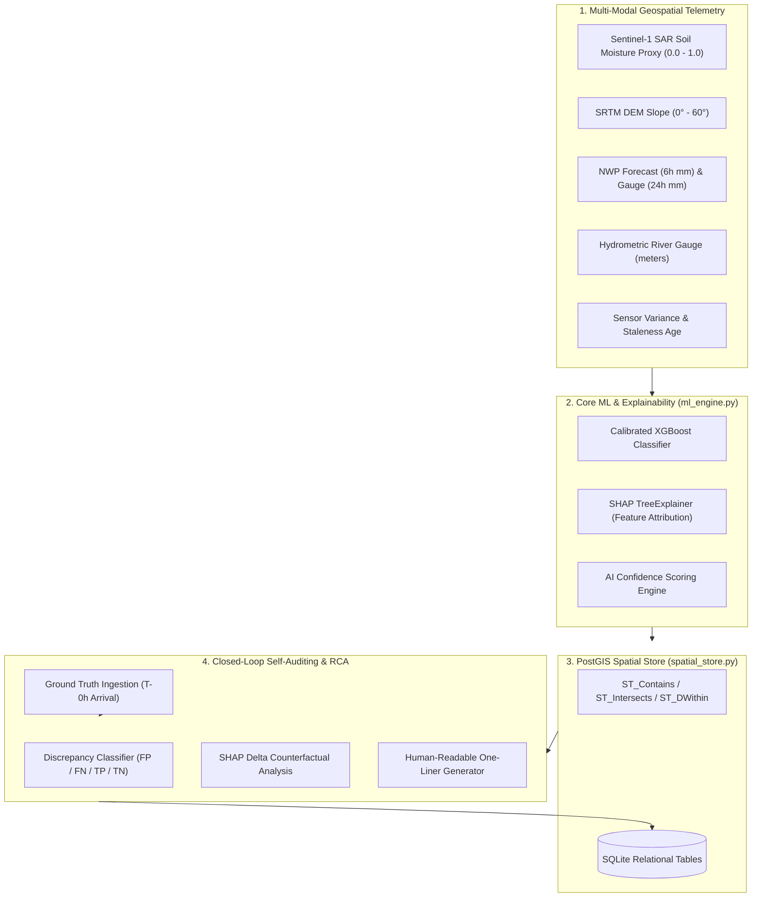

# Self-Auditing Disaster Management Prediction Engine (PS ID: 260001)

> **Role**: Principal MLOps & Geospatial AI Architect  
> **Backend**: Python 3.10+, FastAPI, XGBoost, SHAP, SQLite / PostGIS Spatial Emulation

---

## 1. System Overview & Architecture

The **Self-Auditing Disaster Management Prediction Engine** is a production-grade, closed-loop machine learning pipeline designed for high-stakes flood and inundation hazard prediction. Unlike traditional black-box forecasting systems, this engine features an automated **Post-Inference Self-Auditing Loop** with **SHAP Delta Root Cause Analysis (RCA)**.



### Key Engineering Innovations:
1. **Multi-Modal Geospatial Ingestion**: Ingests Sentinel-1 SAR soil saturation, SRTM DEM slope, precipitation telemetry, and hydrometric river levels.
2. **Explainable AI (XAI)**: Exact local feature attributions via `shap.TreeExplainer`.
3. **Sensor-Aware Confidence Scoring**: Adjusts model certainty based on sensor noise/variance and telemetry staleness.
4. **PostGIS Emulation Layer**: Native spatial queries (`ST_Contains`, `ST_Intersects`, `ST_DWithin`) and hydrographic catchment mapping without heavy C-library dependencies.
5. **Post-Inference Self-Auditing Loop**: Automatically audits past predictions against ground truth, flags False Positives/Negatives, computes SHAP deltas, and isolates the root cause in human-readable plain language.

---

## 2. Mathematical Formulations

### A. AI Confidence Score
Real-world geospatial sensors suffer from telemetry latency and sensor noise. The engine calculates an AI Confidence Score $C \in [0.05, 0.99]$:

$$C_{\text{model}} = 0.50 + |P_{\text{risk}} - 0.50|$$
$$\text{Penalty}_{\text{staleness}} = \min(0.35, \text{staleness\_hours} \times 0.015)$$
$$\text{Penalty}_{\text{variance}} = \min(0.30, \text{sensor\_variance} \times 0.40)$$
$$\text{Confidence} = C_{\text{model}} \times (1 - \text{Penalty}_{\text{staleness}}) \times (1 - \text{Penalty}_{\text{variance}})$$

### B. SHAP TreeExplainer & RCA Deltas
For each prediction, SHAP values $\phi_i$ explain the margin shift from baseline $E[f(x)]$:

$$f(x) = E[f(x)] + \sum_{i=1}^M \phi_i$$

When ground-truth outcome $y_{\text{actual}}$ conflicts with predicted outcome $\hat{y}$ (False Positive or False Negative):
1. A counterfactual feature vector $x_{\text{counterfactual}}$ is built using realized ground-truth measurements (e.g. actual realized rainfall vs overestimated forecast).
2. Counterfactual SHAP values $\phi_i^{\text{cf}}$ are computed.
3. The attribution delta $\Delta \phi_i = \phi_i^{\text{predicted}} - \phi_i^{\text{cf}}$ isolates the exact feature driving the misclassification error.
4. The feature with the highest $|\Delta \phi_i|$ is tagged as the **Primary Culprit Feature**.

---

## 3. Directory & Module Structure

```text
├── synthetic_data.py       # 1,000-row physical hydrology dataset generator & XGBoost trainer
├── ml_engine.py            # DisasterRiskPredictor, SHAP explainer, confidence scorer & RCA loop
├── spatial_store.py        # SQLite database + PostGIS spatial emulation (ST_Contains, ST_DWithin)
├── schemas.py              # Strictly typed Pydantic V2 models for requests, responses & logs
├── main.py                 # Production FastAPI REST application & OpenAPI router
├── test_engine.py          # Comprehensive test suite covering ML, spatial, and API contracts
├── run_demo.py             # 3-stage interactive CLI demo for evaluators
├── requirements.txt        # Pinned Python package dependencies
├── start.bat / start.ps1   # Quick Windows launch scripts
└── README.md               # Technical documentation
```

---

## 4. Quick Startup Instructions

### Prerequisites
- Python 3.10+
- (Optional) Virtual environment recommended

### Installation & Execution

```bash
# 1. Install dependencies
pip install -r requirements.txt

# 2. Train and serialize the XGBoost model (auto-generates 1,000 synthetic rows)
python synthetic_data.py

# 3. Run the complete test suite
python test_engine.py

# 4. Run the interactive 3-stage CLI demo
python run_demo.py

# 5. Launch the FastAPI service
uvicorn main:app --reload --host 0.0.0.0 --port 8000
```

Interactive Swagger API docs will be available at: **`http://localhost:8000/docs`**

---

## 5. REST API Specifications

### 1. `POST /api/v1/predict`
Accepts multi-modal telemetry and returns risk probability, tier, confidence score, and top SHAP attributions.

**Request Payload:**
```json
{
  "telemetry": {
    "rainfall_last_24h": 35.0,
    "forecasted_rainfall_next_6h": 78.5,
    "soil_saturation_index": 0.38,
    "dem_slope_degrees": 4.2,
    "river_water_level_m": 4.10,
    "staleness_hours": 1.0,
    "sensor_variance": 0.08,
    "coordinates": {
      "latitude": 19.10,
      "longitude": 72.92,
      "elevation_m": 8.5,
      "catchment_id": "CATCHMENT_DELTA_01"
    }
  }
}
```

**Response Payload (Truncated):**
```json
{
  "prediction_id": "PRED-9C21A4B0",
  "timestamp": "2026-09-10T17:15:00Z",
  "risk_score": 0.7420,
  "risk_level": "HIGH",
  "confidence_score": 0.7182,
  "confidence_breakdown": {
    "model_certainty": 0.7420,
    "staleness_penalty": 0.0150,
    "variance_penalty": 0.0320,
    "final_confidence": 0.7182
  },
  "top_shap_features": [
    {
      "feature_name": "forecasted_rainfall_next_6h",
      "feature_value": 78.5,
      "shap_value": 0.3845,
      "direction": "INCREASES_RISK",
      "relative_importance_pct": 44.8
    }
  ],
  "base_value": 0.4850,
  "spatial_context": {
    "catchment": {
      "catchment_id": "CATCHMENT_DELTA_01",
      "name": "Coastal Delta Lowlands",
      "vulnerability_index": 0.88
    }
  }
}
```

---

### 2. `POST /api/v1/audit`
Executes the self-auditing loop against observed ground truth, running SHAP delta RCA.

**Request Payload:**
```json
{
  "prediction_id": "PRED-9C21A4B0",
  "actual_ground_truth": 0,
  "observed_rainfall_next_6h": 14.5,
  "observed_river_water_level_m": 4.35,
  "notes": "Post-event storm shear verification"
}
```

**Response Payload:**
```json
{
  "audit_id": "AUDIT-5E8D2134",
  "prediction_id": "PRED-9C21A4B0",
  "predicted_risk_score": 0.7420,
  "predicted_risk_level": "HIGH",
  "actual_ground_truth": 0,
  "discrepancy_type": "FALSE_POSITIVE",
  "is_mismatch": true,
  "primary_culprit_feature": "forecasted_rainfall_next_6h",
  "rca_explanation": "False Alarm caused by 441% overestimated rainfall forecast (78.5mm vs realized 14.5mm) overriding dry soil moisture (0.38).",
  "audited_at": "2026-09-10T17:20:00Z"
}
```

---

### 3. `GET /api/v1/audit/logs`
Returns historical audit records and aggregate precision/recall metrics to feed an administrative monitoring dashboard.

---

### 4. `POST /api/v1/simulate/time-travel`
**Pre-packaged demonstration endpoint for judges & evaluators.**  
Simulates the entire 3-stage disaster lifecycle in under 10 seconds:
- **Stage 1 (T-24h)**: Pre-event forecast triggers High Risk alarm.
- **Stage 2 (T-0h)**: Ground truth arrives showing storm sheared away (No Flood).
- **Stage 3 (T+1h)**: Automated RCA audit executes SHAP delta analysis, isolates the overestimated forecast, and returns the one-liner verdict.

---

## 6. MLOps Extensibility
- **Continuous Feedback**: Misclassified events logged in `audit_logs` feed an active learning retraining pipeline.
- **Model Governance**: Serialized `model_metadata.json` tracks feature distribution baselines, expected values, and performance metrics (AUC / F1).
- **Spatial Scalability**: Ready for zero-friction migration to Amazon RDS PostgreSQL / PostGIS.
# AI-EARLY-DISASTER-PREDECTION

