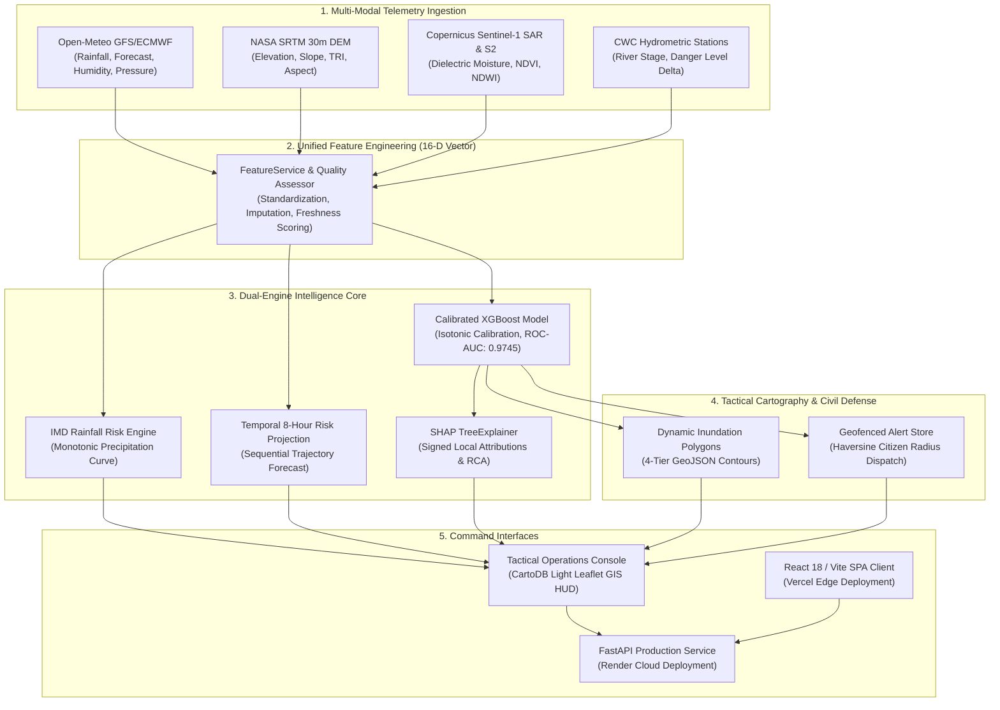
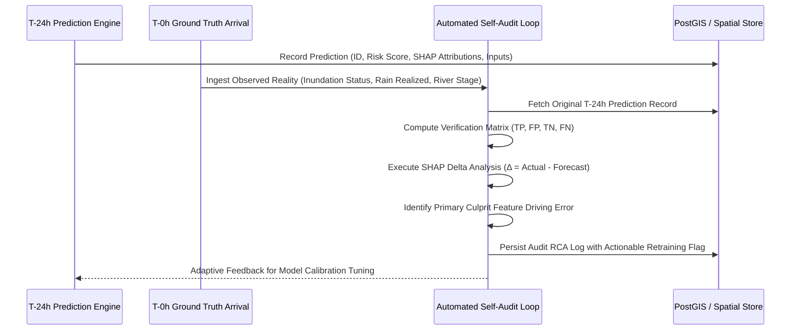

# Technical Implementation Plan: AI-Powered Landscape Early Warning System
**Smart India Hackathon (SIH 2026) — Problem Statement ID: 260001**
**Domain**: Disaster Management, Remote Sensing, Geospatial AI & MLOps

---

## 1. Executive Summary & Objective

The **AI-Powered Landscape Early Warning System** is an operational, government-grade decision support platform designed to detect, forecast, and explain landscape and environmental disaster risks (landslides, flash floods, extreme precipitation runoff, terrain instability) before disasters strike. 

The system focuses primarily on **Northeast India** (Assam, Arunachal Pradesh, Meghalaya, Nagaland, Manipur, Mizoram, Tripura, and Sikkim) as well as critical river basins across India. It couples:
1. **Live Meteorological Observations**: Open-Meteo NWP ECMWF/GFS global models.
2. **Topographic Elevation Analysis**: NASA SRTM 30m Digital Elevation Models (DEM).
3. **Spaceborne Radar & Optical Remote Sensing**: Copernicus Sentinel-1 Synthetic Aperture Radar (SAR) and Sentinel-2 Multispectral imagery.
4. **Calibrated Machine Learning**: Gradient-boosted decision trees (XGBoost) with 5-fold Isotonic Probability Calibration.
5. **eXplainable AI (XAI)**: SHAP (Shapley Additive exPlanations) TreeExplainer feature attributions for root-cause transparency.
6. **Tactical GIS Cartography & Geofencing**: Real-time Leaflet GIS mapping with 4-tier inundation hazard polygons and automated geofenced civil defense emergency alerting.



---

## 2. Multi-Modal Feature Pipeline (16-Dimensional Vector)

The inference pipeline standardizes inputs into a 16-dimensional continuous feature vector:

$$\mathbf{x} = \big[ x_1, x_2, \dots, x_{16} \big] \in \mathbb{R}^{16}$$

| Feature Index | Feature Name | Units | Range | Physical Meaning & Data Source |
| :---: | :--- | :---: | :---: | :--- |
| $x_1$ | `rainfall_24h` | mm | $[0, 500]$ | 24-hour antecedent precipitation (Open-Meteo GFS/ECMWF) |
| $x_2$ | `forecast_rainfall_6h` | mm | $[0, 300]$ | 6-hour numerical forecast rainfall surge (Open-Meteo) |
| $x_3$ | `soil_saturation` | ratio | $[0.0, 1.0]$ | Surface moisture index (Sentinel-1 SAR dielectric proxy) |
| $x_4$ | `slope` | degrees | $[0.0, 89.0]$ | Topographic gradient calculated via Horn's formula (NASA SRTM 30m) |
| $x_5$ | `elevation` | meters | $[-50, 8848]$ | Altitude above sea level (Open-Elevation SRTM API) |
| $x_6$ | `aspect` | degrees | $[0.0, 360.0]$ | Slope azimuth bearing relative to geographic north |
| $x_7$ | `terrain_ruggedness` | index | $[0.0, 50.0]$ | Riley's Terrain Ruggedness Index (TRI) representing elevation standard deviation |
| $x_8$ | `temperature` | °C | $[-20, 55]$ | 2-meter ambient dry-bulb temperature (Open-Meteo) |
| $x_9$ | `humidity` | % | $[0.0, 100.0]$ | 2-meter relative air humidity |
| $x_{10}$ | `surface_pressure` | hPa | $[700, 1050]$ | Mean atmospheric barometric surface pressure |
| $x_{11}$ | `wind_speed` | km/h | $[0.0, 200.0]$ | 10-meter sustained wind velocity |
| $x_{12}$ | `ndvi` | index | $[-1.0, 1.0]$ | Normalized Difference Vegetation Index (Sentinel-2 B8/B4) |
| $x_{13}$ | `ndwi` | index | $[-1.0, 1.0]$ | Normalized Difference Water Index (Sentinel-2 B3/B8) |
| $x_{14}$ | `sentinel1_vv` | dB | $[-30.0, 5.0]$ | Vertical-transmit Vertical-receive radar backscatter |
| $x_{15}$ | `sentinel1_vh` | dB | $[-35.0, 0.0]$ | Vertical-transmit Horizontal-receive radar cross-polarization |
| $x_{16}$ | `river_level` | meters | $[0.0, 30.0]$ | Active river gauge stage height relative to local danger datum |

---

## 3. Mathematical & Machine Learning Foundations

### 3.1 XGBoost Classifier & Probability Calibration
Standard decision tree ensembles generate uncalibrated margin scores that cannot be interpreted as true physical probabilities. To address this, the system applies **Isotonic Regression Calibration** (`CalibratedClassifierCV` with 5-fold cross-validation) over an ensemble of 150 gradient-boosted decision trees.

* **Base Estimator**: `XGBClassifier(n_estimators=150, max_depth=5, learning_rate=0.05, subsample=0.85, colsample_bytree=0.85, eval_metric='logloss')`
* **Probability Calibration Function**: 
  $$P(\text{Hazard} = 1 \mid \mathbf{x}) = m\big(\hat{f}_{\text{XGB}}(\mathbf{x})\big)$$
  where $m$ is a piecewise non-decreasing step function fitted via isotonic regression minimizing the Brier score loss.
* **Verified Performance Metrics**:
  * **ROC-AUC**: $0.9745$
  * **Brier Calibration Score**: $0.0411$ (indicates exceptional probabilistic reliability)
  * **Classification Accuracy**: $94.43\%$
  * **Precision**: $84.55\%$ | **Recall**: $80.87\%$ | **F1-Score**: $82.67\%$

### 3.2 Continuous Rainfall Risk Engine (IMD Standards)
Landscape risk and rainfall risk are kept strictly separate. The dedicated **Rainfall Risk Engine** computes a deterministic, monotonically continuous score based on **India Meteorological Department (IMD)** 24-hour rainfall classification and **Central Water Commission (CWC)** hydrologic runoff guidance:

$$R_{\text{eff}} = R_{24\text{h}} + 0.5 \times F_{6\text{h}}$$

$$\text{Risk}_{\text{Rainfall}}(R_{\text{eff}}) = 
\begin{cases} 
5.0 + \frac{R_{\text{eff}}}{2.5} \times 9.9 & R_{\text{eff}} < 2.5\text{ mm (Trace / Very Light)} \\ 
15.0 + \frac{R_{\text{eff}} - 2.5}{13.0} \times 14.9 & 2.5 \le R_{\text{eff}} \le 15.5\text{ mm (Light Rain)} \\ 
30.0 + \frac{R_{\text{eff}} - 15.6}{48.8} \times 29.9 & 15.6 \le R_{\text{eff}} \le 64.4\text{ mm (Moderate Rain)} \\ 
60.0 + \frac{R_{\text{eff}} - 64.5}{51.0} \times 19.9 & 64.5 \le R_{\text{eff}} \le 115.5\text{ mm (Heavy Rain)} \\ 
80.0 + \frac{R_{\text{eff}} - 115.6}{88.8} \times 12.9 & 115.6 \le R_{\text{eff}} \le 204.4\text{ mm (Very Heavy Rain)} \\ 
93.0 + \min\left(6.0, \frac{R_{\text{eff}} - 204.4}{100} \times 6.0\right) & R_{\text{eff}} > 204.4\text{ mm (Cloudburst / Deluge)} 
\end{cases}$$

### 3.3 Explainable AI (SHAP TreeExplainer)
To ensure transparency for disaster response commanders, the system computes local additive feature attributions using the Shapley value formulation:

$$f(\mathbf{x}) = \phi_0 + \sum_{i=1}^{M} \phi_i(\mathbf{x})$$

where:
* $\phi_0$ is the base expected model margin across the background dataset.
* $\phi_i(\mathbf{x})$ is the signed contribution of feature $i$ for the specific incident location.
* $\phi_i > 0$ denotes risk-amplifying factors (e.g., steep slope, soil saturation, torrential rain).
* $\phi_i < 0$ denotes risk-mitigating factors (e.g., dense forest cover, flat terrain, low river stage).

---

## 4. Geospatial Intelligence & Cartography Architecture

### 4.1 Digital Elevation Model (DEM) Slope Processing
Terrain slope is computed on 2D elevation grids using Horn's finite-difference gradient algorithm:

$$\frac{\partial z}{\partial x} = \frac{(z_{i+1, j-1} + 2z_{i+1, j} + z_{i+1, j+1}) - (z_{i-1, j-1} + 2z_{i-1, j} + z_{i-1, j+1})}{8 \Delta x}$$

$$\frac{\partial z}{\partial y} = \frac{(z_{i-1, j+1} + 2z_{i, j+1} + z_{i+1, j+1}) - (z_{i-1, j-1} + 2z_{i, j-1} + z_{i+1, j-1})}{8 \Delta y}$$

$$\theta_{\text{slope}} = \arctan\left(\sqrt{\left(\frac{\partial z}{\partial x}\right)^2 + \left(\frac{\partial z}{\partial y}\right)^2}\right) \times \frac{180^\circ}{\pi}$$

### 4.2 Dynamic 4-Tier Inundation GeoJSON Contours
Based on the predicted risk percentage, terrain slope, and river gauge stage, the GIS engine synthesizes a 25-vertex spatial polygon:

$$\text{Radius}(\theta) = R_{\text{base}} \times \left(1.0 + 0.25 \cos(3\theta) + 0.15 \sin(5\theta)\right) \times \text{SlopeFactor}$$

$$\Delta \text{lat} = \frac{\text{Radius}(\theta) \times \cos(\theta)}{111.32}, \quad \Delta \text{lon} = \frac{\text{Radius}(\theta) \times \sin(\theta)}{111.32 \times \cos(\text{lat}_{\text{rad}})}$$

The polygon is categorized into 4 operational tiers:
1. **Critical Surge Core** (Inundation probability $> 80\%$, solid ruby red fill)
2. **High Hazard Fringe** (Inundation probability $60\% - 80\%$, amber-orange fill)
3. **Moderate Buffer Zone** (Inundation probability $40\% - 60\%$, warning yellow fill)
4. **Hydrologic Runoff Basin** (Inundation probability $< 40\%$, cyan boundary)

---

## 5. Post-Inference Self-Auditing & Root Cause Analysis (RCA)

When ground-truth post-disaster data arrives (via satellite flood maps or CWC gauges), the platform triggers an automated self-audit cycle:



* **False Alarm (False Positive)**: Model predicted hazard, but disaster did not occur. RCA calculates feature deltas: $\Delta_i = x_{i, \text{observed}} - x_{i, \text{forecast}}$ to isolate over-estimated NWP rainfall.
* **Missed Detection (False Negative)**: Model predicted nominal conditions, but localized flash surge occurred. RCA flags unmodeled tributary ingress or micro-cloudbursts.

---

## 6. Northeast India Geographic Presets (8 States)

The system includes pre-calibrated monitoring stations across all 8 Northeast states:

| State | Sector / Station Name | Lat / Lon | Elevation | Slope | Key Vulnerability Profile |
| :--- | :--- | :---: | :---: | :---: | :--- |
| **Assam** | Guwahati (Brahmaputra Floodplain) | $26.1850^\circ\text{N}, 91.7500^\circ\text{E}$ | 54 m | 2.5° | Alluvial bank overflow, Brahmaputra surge |
| **Assam** | Majuli Island / Dhemaji Basin | $26.9600^\circ\text{N}, 94.2200^\circ\text{E}$ | 84 m | 1.2° | River island erosion, Subansiri sand-cast siltation |
| **Arunachal**| Itanagar / Papum Pare (Dikrong Basin) | $27.0970^\circ\text{N}, 93.6150^\circ\text{E}$ | 320 m | 14.5° | Torrential sub-Himalayan slope debris flow |
| **Arunachal**| Pasighat / East Siang (Siang Gorge) | $28.0660^\circ\text{N}, 95.3260^\circ\text{E}$ | 155 m | 12.0° | Transboundary Yarlung-Tsangpo sudden river surges |
| **Meghalaya** | Sohra / Cherrapunji (Khasi Plateau) | $25.2700^\circ\text{N}, 91.7300^\circ\text{E}$ | 1430 m | 18.2° | Extreme orographic cloudburst, vertical runoff |
| **Nagaland**  | Doyang Basin (Wokha / Kohima Ridge) | $25.6701^\circ\text{N}, 94.1077^\circ\text{E}$ | 1444 m | 16.8° | Tectonic shearing, structural ridge slope failure |
| **Manipur**   | Imphal River & Loktak Wetland Catchment | $24.8170^\circ\text{N}, 93.9368^\circ\text{E}$ | 780 m | 1.4° | Intermontane bowl-shaped valley waterlogging |
| **Sikkim**    | Teesta Valley (Gangtok / Mangan Sector)| $27.5300^\circ\text{N}, 88.5300^\circ\text{E}$ | 1280 m | 28.5° | Glacial Lake Outburst Flood (GLOF) & alpine landslide |

---

## 7. Production Deployment & Cloud Architecture

The platform is designed to deploy **completely independently**:
* **Backend**: Render (Python 3.11 ASGI Service with Uvicorn)
* **Frontend**: Vercel (Edge-cached React 18 + Vite SPA)

```
[User Browser / SDMA Operations Console]
       |
       +---> [Vercel Edge Network] ----> Serves React 18 + Vite SPA (dist/)
       |
       +---> [Render Web Service] -----> Serves FastAPI ASGI Backend (:10000)
                   |
                   +---> Open-Meteo API (Live Weather Telemetry)
                   +---> NASA SRTM / Open-Elevation (DEM Grids)
                   +---> Calibrated XGBoost & SHAP Engine
                   +---> Spatial In-Memory / PostGIS Datastore
```

### Production Configuration Files
1. **Render Configuration** ([`render.yaml`](file:///c:/Users/HP%20640%20G8/.antigravity-ide/render.yaml)):
   * **Runtime**: Python 3.11.9
   * **Build Command**: `pip install -r requirements.txt`
   * **Start Command**: `python -m uvicorn main:app --host 0.0.0.0 --port $PORT`
   * **Health Check Path**: `/health`
   * **Environment Variables**: `PYTHON_VERSION=3.11.9`, `CORS_ORIGINS=*`
2. **Vercel Configuration** ([`frontend/vercel.json`](file:///c:/Users/HP%20640%20G8/.antigravity-ide/frontend/vercel.json)):
   * **Framework Preset**: `Vite`
   * **Build Command**: `npm run build`
   * **Output Directory**: `dist`
   * **Rewrites**: `/(.*)` $\rightarrow$ `/index.html` (SPA client routing)
   * **Environment Variables**: `VITE_BACKEND_API_URL=https://<your-render-service>.onrender.com`

---

## 8. Verification & Validation Protocol

```bash
# 1. Start backend server locally
python -m uvicorn main:app --host 0.0.0.0 --port 8000

# 2. Check health endpoint (returns HTTP 200 {"status":"ok"})
curl -X GET http://localhost:8000/health

# 3. Test calibrated prediction pipeline
curl -X POST http://localhost:8000/api/v1/predict \
  -H "Content-Type: application/json" \
  -d '{
    "rainfall": 48.0,
    "forecast_rainfall": 65.0,
    "soil_saturation": 0.72,
    "slope": 9.2,
    "river_level": 4.5,
    "latitude": 26.1850,
    "longitude": 91.7500
  }'

# 4. Start frontend development server
python frontend_dev_server.py
# Accessible on http://localhost:5173
```
